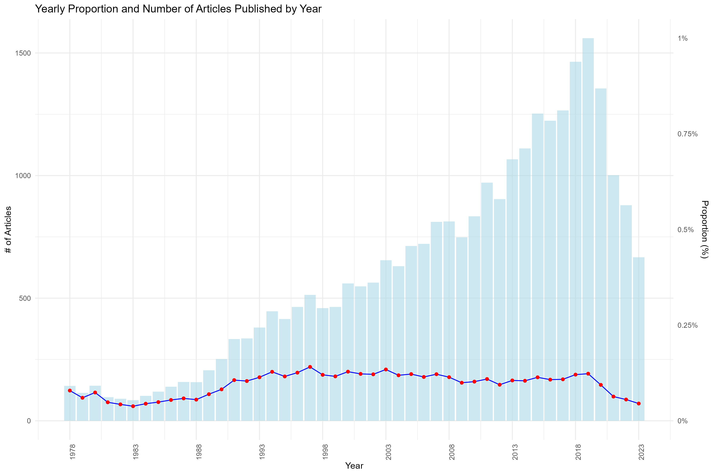
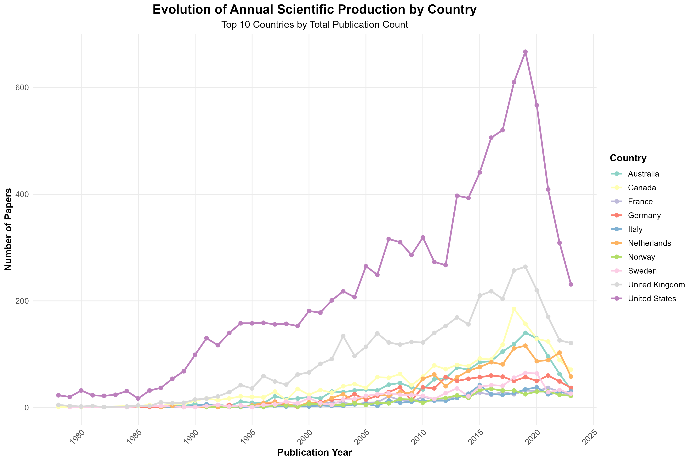
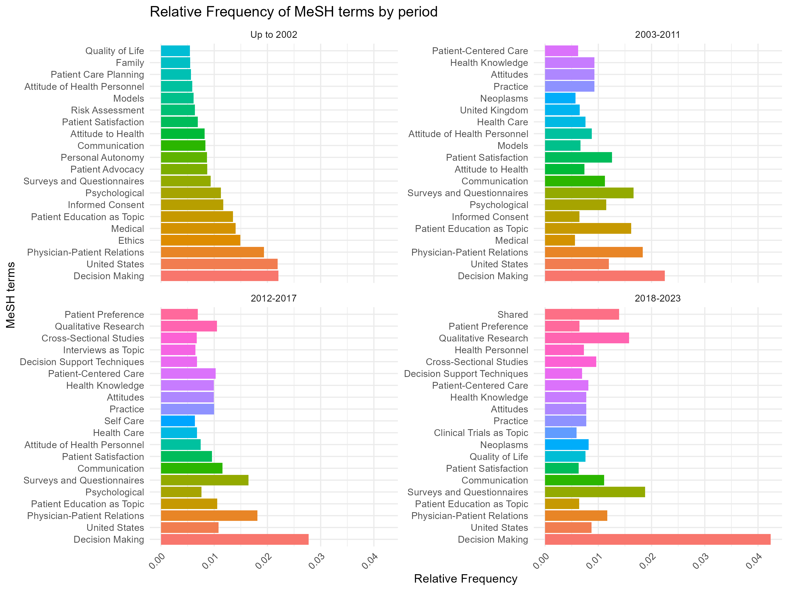
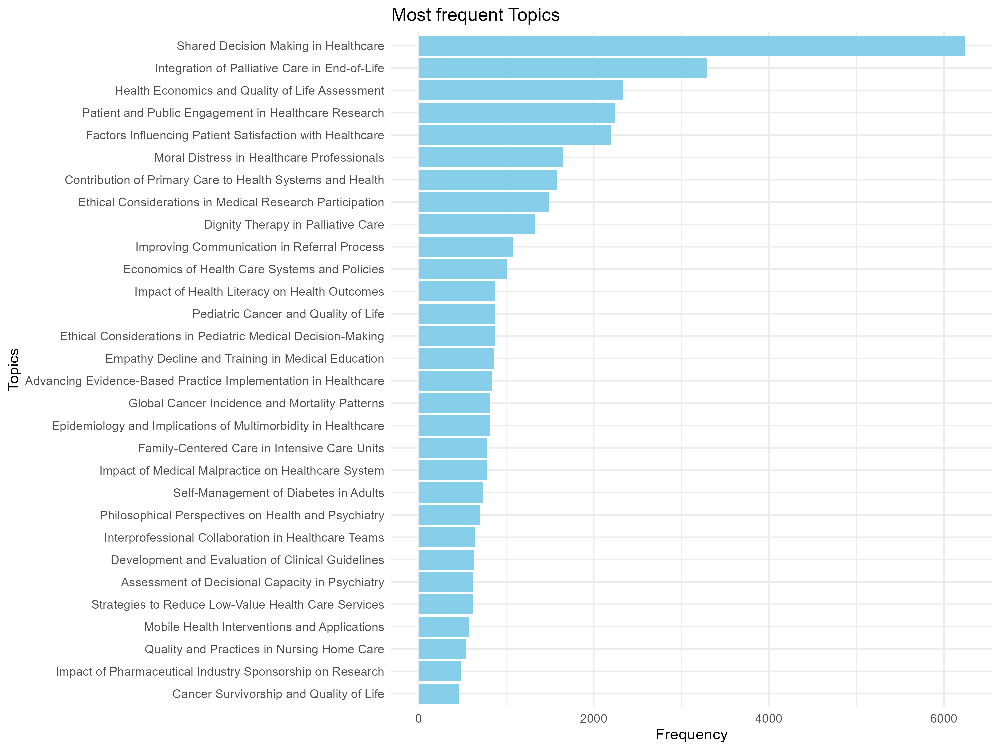
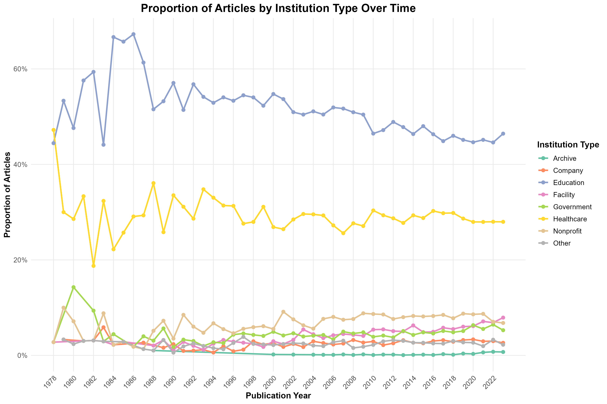
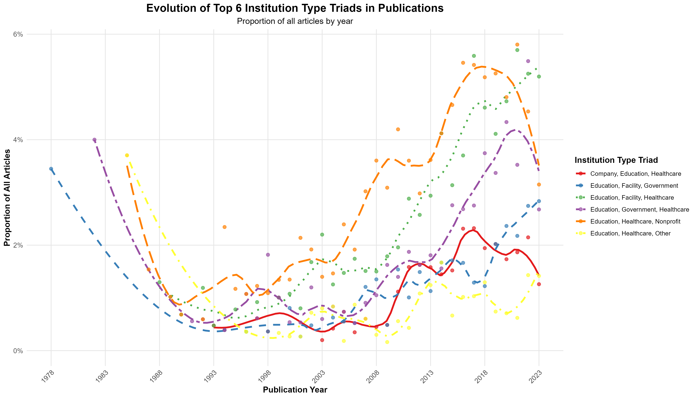

## Introducción

La ciencia ciudadana implica la participación pública en la investigación científica, desde la recolección de datos hasta el análisis y la resolución de problemas. En el ámbito de la salud, esto se traduce con frecuencia en la participación de pacientes en investigaciones, lo que puede acelerar descubrimientos y alinear la investigación con las necesidades reales de los pacientes.

Para comprender el panorama actual de la participación de pacientes en investigación científica, realizamos un análisis bibliométrico centrado en artículos relacionados con este tema en PubMed.

## Metodología

Utilizamos las siguientes fuentes de datos y métodos:

1. **PubMed**: La mayor base de datos de literatura biomédica.
2. **OpenAlex**: Un catálogo bibliométrico de código abierto que aporta información temática.
3. **ROR (Research Organization Registry)**: Para identificar organizaciones de investigación.

## Principales hallazgos

### Crecimiento de la investigación en participación de pacientes  
  
Este gráfico muestra la evolución de artículos sobre participación de pacientes a lo largo del tiempo. Observamos una clara tendencia al alza, aunque la proporción respecto al total de artículos publicados se mantiene estable.

### Distribución geográfica  
  
Este mapa ilustra la distribución geográfica de los artículos. Estados Unidos y Reino Unido lideran la producción, seguidos por Europa y Australia.

### Evolución temática  
  
Este diagrama de red muestra cómo han evolucionado los temas clave a lo largo del tiempo: desde “toma de decisiones” y “atención centrada en el paciente” hasta “relación médico-paciente”.

### Temas más investigados  
  
Aquí se presentan los temas más frecuentes en esta línea de investigación. “Toma de decisiones compartida” encabeza la lista, seguida de “atención centrada en el paciente” y “investigación cualitativa”.

### Participación institucional  
  
Este gráfico de sectores muestra los tipos de instituciones involucradas. Universidades y hospitales lideran, con participación destacada de ONGs y agencias gubernamentales.

### Patrones de colaboración  
  
Este gráfico revela las combinaciones más frecuentes de colaboración institucional. La tríada universidades-hospitales-ONGs es la más común.

## Análisis e implicaciones

1. **Interés creciente**: La producción creciente de artículos muestra un reconocimiento del valor de la participación del paciente.
2. **Concentración geográfica**: Aunque se concentra en ciertos países, hay margen de expansión global.
3. **Temas en evolución**: Se evidencia una transición de modelos centrados en el médico hacia enfoques centrados en el paciente.
4. **Enfoque multidisciplinar**: La diversidad institucional refleja un abordaje integral de la participación.
5. **Tendencias metodológicas**: La investigación cualitativa y la toma de decisiones compartida indican un interés por la experiencia y preferencias del paciente.

---

**Licencia: CC BY 4.0** – Puedes reutilizar este contenido con atribución.
